<div align="center">

<picture>
  <source media="(prefers-color-scheme: dark)" srcset="dark.svg">
  <source media="(prefers-color-scheme: light)" srcset="light.svg">
  
</picture>

</div>

<br/>

## ⚡ About Me

```yaml
name: Maria Hyder
role: Undergraduate Electrical Engineer
university: National University of Sciences and Technology (NUST CEME)
focus: [Embedded Systems,Machine Learning, Circuit Design, Applied AI, PCB Design]
currently_building: "Project Vision-Edge — an edge-AI defect inspection system"
also_into: [Sketching, Graphic Design, Web Design]
fun_fact: "I design circuits by day and sketch by night 🎨"
```

I'm an Electrical Engineering student who likes projects that sit at the intersection of **hardware and intelligence** — from simulating antennas in HFSS to training a neural network that can run on embedded hardware. I care about clean documentation, methodical debugging, and building things that actually work outside of a simulation window.

<br/>

## 🛠️ Tools & Technologies

**Programming**
<br/>


**EDA, Simulation & Embedded**
<br/>


**AI / ML (for embedded deployment)**
<br/>


**Productivity & Design**
<br/>


<br/>

## 🚀 Featured Project — FYP

<table>
<tr>
<td width="100%">

### ⚡ Project Vision-Edge
**An edge-deployable AI vision system for automated defect inspection**

A complete ML pipeline that trains a defect-classification model and compresses it down for **real-world embedded/FPGA deployment** — not just a notebook demo. Built to actually run inference on constrained hardware, with a live webcam inspection mode and heatmap visualization.

**Pipeline highlights:**
- 🧠 Custom CNN training with data augmentation (flips, rotation, brightness/contrast, zoom) for lighting/angle robustness
- ⚙️ Two-stage TFLite conversion — a fast PC-testing model and a **fully INT8-quantized model for embedded deployment**
- 📊 Automated threshold analysis to tune the good/defective decision cutoff against real accuracy trade-offs
- 🎥 Live webcam inspection mode with heatmap overlay + batch inspection with CSV reporting
- ⏱️ Built-in latency benchmarking to compare float32 vs INT8 inference speed

`Python` `TensorFlow` `TensorFlow Lite (INT8 Quantization)` `OpenCV` `scikit-learn` `Computer Vision` `Embedded Deployment`

<!-- 🔗 Add your repo link here: [View Repository »](https://github.com/MariaHyder/Project-Vision-Edge) -->

</td>
</tr>
</table>

<br/>

## 💡 Other Projects

<table>
<tr>
<td width="50%" valign="top">

**📡 2×1 Microstrip Patch Antenna Design (WPA)**
<br/>
Designed and optimized a 5.15 GHz antenna array in HFSS to improve gain and return loss.
<br/>
`Ansys HFSS` `RF Design`

</td>
<td width="50%" valign="top">

**🧭 SafePak — Tourism Assistance App**
<br/>
A smart tourism guide application concept for safe travel across Pakistan. *(ongoing)*
<br/>
`App Design` `Concept Development`

</td>
</tr>
<tr>
<td width="50%" valign="top">

**🔊 Audio Amplifier**
<br/>
Designed and analyzed an electronic amplifier circuit for signal enhancement.
<br/>
`LTspice` `Circuit Design`

</td>
<td width="50%" valign="top">

**🌡️ Digital Thermometer System**
<br/>
Sensor-based temperature monitoring system with OLED display and alert mechanism.
<br/>
`Microprocessor` `Embedded C`

</td>
</tr>
<tr>
<td width="50%" valign="top">

**🚌 Transportation Booking System**
<br/>
OOP-based booking system with seat tracking and automatic ticket generation.
<br/>
`C++` `OOP`

</td>
<td width="50%" valign="top">

**🏦 Bank Management System**
<br/>
A console-based banking system covering core account management operations.
<br/>
`C++`

</td>
</tr>
<tr>
<td width="50%" valign="top">

**🔢 ALU Design**
<br/>
Designed and simulated an Arithmetic Logic Unit using digital logic concepts.
<br/>
`Digital Logic Design`

</td>
<td width="50%" valign="top">

**🎨 Graphic Design Work**
<br/>
Presentation layouts, posters, and branding visuals created during design internships.
<br/>
`Graphic Design` `Branding`

</td>
</tr>
</table>

<br/>

## 🧭 Experience & Involvement

- **Avionics Engineering Intern** — Pakistan International Airlines (PIA)
- **Machine Learning Intern** — Arch Technologies 
- **Graphic Designing Intern** — DevelopersHub Corporation
- **ASME CEME NUST** — Deputy Director Registrations / Admin & HR Director / Decor & Security Volunteer
- **OpenHouse, NUST CEME** — Event operations & recruitment coordination volunteer
- **PBS DataFest** — Guest of Honor Volunteer

<br/>

## 📊 GitHub Stats

<div align="center">


</div>

<div align="center">

</div>

<br/>

## 📬 Connect With Me

<div align="center">

<a href="mailto:mhyder.ee45ceme@student.nust.edu.pk"></a>
<a href="http://pk.linkedin.com/in/maria-hyder-685664343"></a>

</div>


